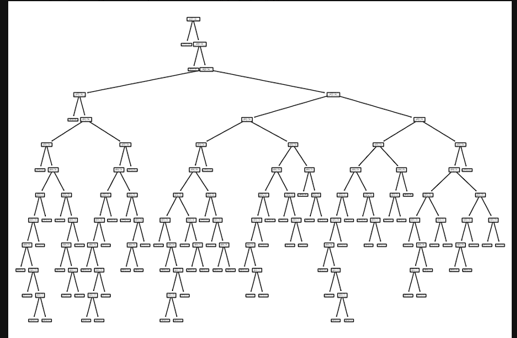
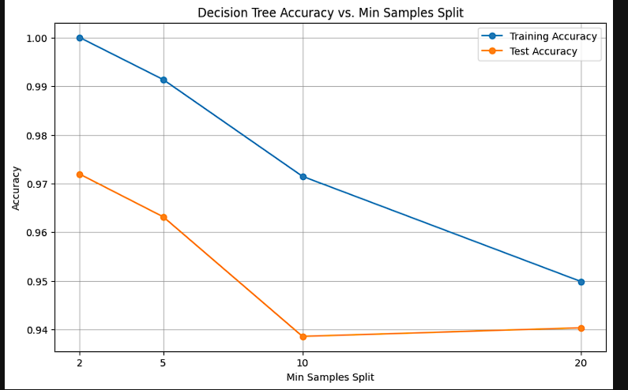

# Enhanced Analysis of Decision Tree Classifier on Car Evaluation Dataset

## 1. Problem Overview
This study aims to delve into the performance intricacies of a decision tree classifier when applied to a car evaluation dataset, focusing on how variations in tree depth and the minimum samples required to split affect the classifier's accuracy.

## 2. Background
Decision tree classifiers, celebrated for their simplicity and interpretability, often face performance variability influenced by dataset peculiarities and hyperparameter configurations. This exploration seeks to unearth the relationship between classifier accuracy and its hyperparameters within the realm of car evaluations.

## 3. Dataset Synopsis
The dataset features variables such as buying price, maintenance cost, door count, seating capacity, luggage boot size, safety rating, and an overall car evaluation (ranging from unacceptable to very good). Prior to analysis, the dataset was meticulously preprocessed, transforming all categorical attributes into a numerical format suitable for machine learning models.

## 4. Methodological Approach
Our approach harnesses a decision tree classifier governed by the entropy criterion. We methodically adjust the tree depth and minimum samples split to gauge their impact on the model's accuracy.

## 5. Model Development and Analysis

- **Essential Library Imports**:
  Begin with importing libraries critical for data manipulation, model development, evaluation, and graphical representation.
```python
from sklearn.tree import DecisionTreeClassifier
import pandas as pd
import matplotlib.pyplot as plt
import category_encoders as ce
from sklearn.model_selection import train_test_split
from sklearn.metrics import accuracy_score
```
## Dataset Preparation:
Load and prepare the dataset for analysis, ensuring all categorical variables are appropriately encoded.
```python
df = pd.read_csv('car_evaluation.csv')
```
## Exploratory Data Analysis (EDA):
Undertake a comprehensive examination of the dataset to understand its structure, identify patterns, and assess class distributions.
```python
df.info()
df['class'].value_counts().plot(kind='bar')
```
## Data Encoding and Splitting:
Encode categorical variables and split the dataset into training and testing subsets.
```python
# Separating features and target variable
X = df.drop(['class'], axis=1)
y = df['class']

# Encoding categorical variables
encoder = ce.OrdinalEncoder()
X_encoded = encoder.fit_transform(X)

# Splitting the dataset
X_train, X_test, y_train, y_test = train_test_split(X_encoded, y, test_size=0.33, random_state=42)
```
## Model Training and Systematic Parameter Analysis:
Train the decision tree classifier and vary its parameters to find the optimal configuration.
```python
# Example: Training a decision tree classifier with specific parameters
clf = DecisionTreeClassifier(criterion="entropy", max_depth=5, min_samples_split=2)
clf.fit(X_train, y_train)

# Predicting and evaluating the model
predictions = clf.predict(X_test)
accuracy = accuracy_score(y_test, predictions)
print(f'Accuracy: {accuracy:.4f}')
```
## Decision Tree Visualization:


## Decision Tree Accuracy vs. Min Samples Split


## Insights and Findings
Our findings elucidate that classifier accuracy escalates with increased tree depth.
A consistent accuracy rate was observed for a tree depth of 3, regardless of the minimum samples split.
Optimal performance was noted at a tree depth of 9 and a minimum samples split of 2, achieving an accuracy of approximately 96.14%.
##  Conclusive Remarks
The decision tree classifier has demonstrated notable efficiency in classifying car evaluations, with optimal results achieved through specific hyperparameter adjustments. 
However, the potential for overfitting with excessively deep trees necessitates a balanced approach to parameter tuning. 
Future endeavors could explore additional validation strategies to bolster model performance and reliability, solidifying the decision tree classifier's position as a potent tool in the predictive modeling arsenal.
